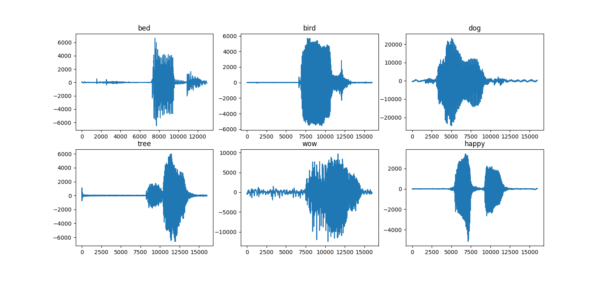
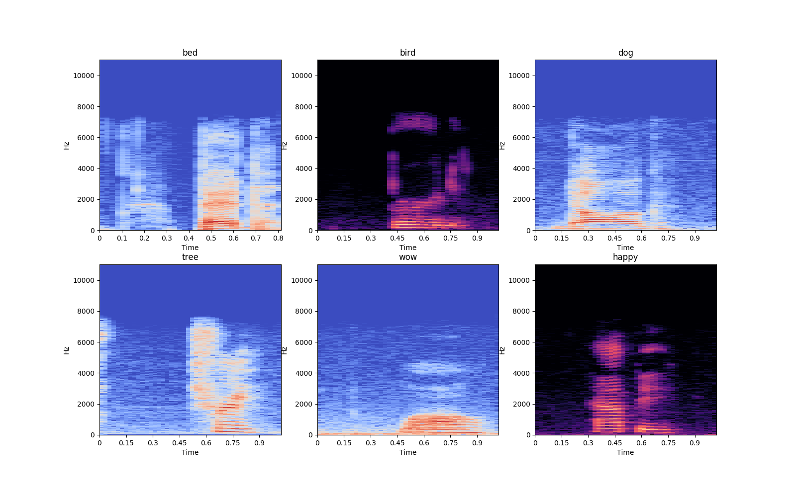
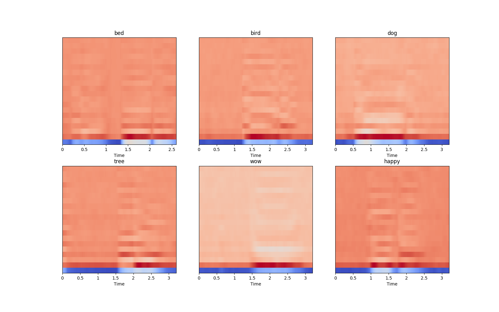

# TensorFlow-Speech-Recognition-Challenge

Tensorflow Speech Recognition Challenge is a Kaggle competition organised by Google Brain aim to classify 30 words into one of the 12 specified classes.
https://www.kaggle.com/c/tensorflow-speech-recognition-challenge

# Data Preprocessing
Librosa package was used for loading wav files, it will load the wav file as time series. 
https://librosa.github.io/librosa/generated/librosa.core.load.html
The following figure show some of the wav file representation in time domain: 

  

Because it's hard to work with wav file in time domain, it's better to convert them to time-frequency domain by computing discrete Fourier transforms (DFT).
The following figure show some of the wav file representation in time-frequency domain: 

  

Librosa Package was used for extracting MFCC feature for each wav file, https://librosa.github.io/librosa/generated/librosa.feature.mfcc.html
The following figure show some of the wav file representation after extracting MFCC features: 

  

# Model
5 Layers Bidirectional LSTM was used.
